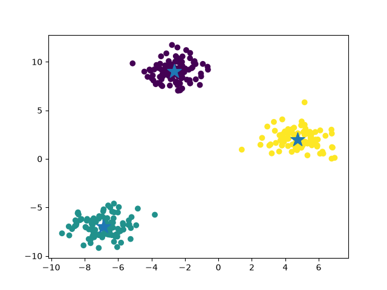

## Machine Learning Algorithms — Python Implementations
A clean, light, hands-on repository showcasing lightweight Python implementations of foundational Machine Learning, Deep Learning, and Reinforcement Learning algorithms. Built using small datasets and simple configurations, this project is ideal for quick local execution, self-study, and classroom demonstrations.

📁 Project Structure

Machine Learning/
│
├── CatBoost.py
├── decision_tree.py
├── KMeans.py
├── KMeans.png
├── lightGBM.py
├── linear_regression.py
├── QLearning.py
├── Transformer.py
└── XGBoost.py

## Contents

| Script | Category | Description |
|---|---|---|
| `Linear_regression.py` | Regression | Fits a linear regression model on synthetic data (`make_regression`) and reports MSE. |
| `Decision_tree.py` | Classification | Trains a `DecisionTreeClassifier` on the Iris dataset and reports accuracy. |
| `XGBoost.py` | Classification (Gradient Boosting) | Trains an `XGBClassifier` on Iris using gradient-boosted trees. |
| `LightGBM.py` | Classification (Gradient Boosting) | Trains an `LGBMClassifier` on Iris using LightGBM's gradient boosting framework. |
| `CatBoost.py` | Classification (Gradient Boosting) | Trains a `CatBoostClassifier` on Iris using CatBoost's gradient boosting framework. |
| `KMeans.py` | Clustering | Clusters synthetic blob data into 3 groups using K-Means and visualizes the clusters with matplotlib. |
| `QLearning.py` | Reinforcement Learning | Implements tabular Q-learning on a simple 6-state, 2-action environment. |
| `Transformer.py` | Deep Learning | Implements a minimal single-head self-attention (Transformer-style) mechanism from scratch using PyTorch. |

## Requirements

Install the dependencies before running any script:

```bash
pip install numpy scikit-learn matplotlib xgboost lightgbm catboost torch
```

> Note: Not every script needs every package — see the table below for per-script requirements.

| Script | Dependencies |
|---|---|
| `Linear_regression.py` | `scikit-learn` |
| `Decision_tree.py` | `scikit-learn` |
| `XGBoost.py` | `scikit-learn`, `xgboost` |
| `LightGBM.py` | `scikit-learn`, `lightgbm` |
| `CatBoost.py` | `scikit-learn`, `catboost` |
| `KMeans.py` | `scikit-learn`, `matplotlib` |
| `QLearning.py` | `numpy` |
| `Transformer.py` | `torch` |

## Usage

Each script can be run independently:

```bash
python Linear_regression.py
python Decision_tree.py
python XGBoost.py
python LightGBM.py
python CatBoost.py
python KMeans.py
python QLearning.py
python Transformer.py
```

## Script Details

### `Linear_regression.py`
Generates a synthetic single-feature regression dataset, splits it into train/test sets, fits a `LinearRegression` model, and prints the mean squared error on the test set.

### `Decision_tree.py`
Loads the Iris dataset, splits it into train/test sets, fits a `DecisionTreeClassifier`, and prints the actual vs. predicted labels along with accuracy.

### `XGBoost.py`
Same Iris classification setup as `Decision_tree.py`, but uses XGBoost's `XGBClassifier` (100 trees, depth 3, learning rate 0.1).

### `LightGBM.py`
Same Iris classification setup, using LightGBM's `LGBMClassifier` (100 estimators, depth 3, learning rate 0.1).

### `CatBoost.py`
Same Iris classification setup, using CatBoost's `CatBoostClassifier` (100 iterations, depth 3, learning rate 0.1).

### `KMeans.py`
Generates 300 synthetic points across 3 blobs (`make_blobs`), fits a `KMeans(n_clusters=3)` model, and plots the resulting clusters with their centroids (marked as stars):



### `QLearning.py`
Implements tabular Q-learning over 500 episodes on a simple linear 6-state environment (states 0–5, goal state = 5). Learns and prints the final Q-table using a standard Bellman update with `alpha=0.8` and `gamma=0.9`.

### `Transformer.py`
Builds a minimal self-attention block from scratch: computes Query, Key, and Value projections for a 3-token sequence, calculates scaled dot-product attention scores, applies softmax, and produces the final attention-weighted output — a from-scratch illustration of the core mechanism behind Transformer models.

## Dataset Sources

- **Iris dataset**: loaded via `sklearn.datasets.load_iris` (used by `Decision_tree.py`, `XGBoost.py`, `LightGBM.py`, `CatBoost.py`).
- **Synthetic regression data**: generated via `sklearn.datasets.make_regression` (`Linear_regression.py`).
- **Synthetic blob data**: generated via `sklearn.datasets.make_blobs` (`KMeans.py`).
- **QLearning / Transformer**: no external dataset; environment/inputs are defined directly in the script.

🎯 Learning Objectives

This project demonstrates practical implementations of:

Classification
Regression
Clustering
Ensemble Learning
Gradient Boosting
Reinforcement Learning
Self-Attention
Model Training and Prediction
Model Evaluation
Data Visualization

The examples are intentionally simple so that the underlying concepts and code flow can be understood easily.

